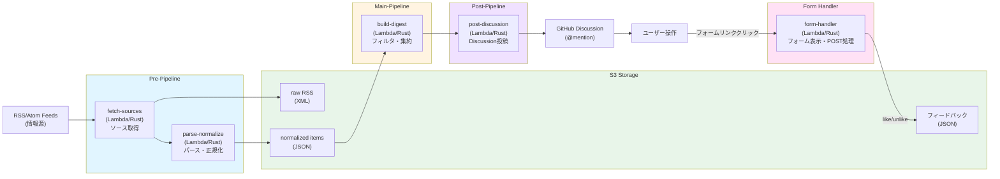

# curatedz

複数のRSSフィードを取り込み、正規化したJSONをS3へ保存しつつ、日次/定期のダイジェストをprivate repositoryのGitHub Discussionで通知する最小コスト構成のシステムです。

- **Step Functions** で各処理を疎結合に分離し、再試行・調査が容易
- **Lambda (Rust)** で高速・低コストな処理を実現
- **CDK (TypeScript)** でインフラをコード管理
- **GitHub Discussion** への投稿で通知を受け取り、Webフォームで記事を評価
- 後から学習・評価ループを足せるように、raw RSS と normalized items をS3に残す設計です

---

## ゴール / 非ゴール

### ゴール
- RSS → 正規化JSON（items）に変換し S3に永続化
- 最新分を フィルタ/集約して **GitHub Discussionで通知**
- Webフォームで記事を評価（like/unlike/non-selected）し、S3にフィードバックを保存
- 最小構成で運用可能（失敗時の再実行・調査ができる）

### 非ゴール（今はやらない）
- フィードバックデータを使った機械学習モデルの訓練
- LLM要約や自動タグ付け
- 高度な全文検索/分析基盤（Athena等）

---

## 概念図



**パイプライン構成:**
- **Pre-Pipeline**: RSSフィードの取得と正規化JSON変換
- **Main-Pipeline**: 正規化JSONのフィルタリング・集約
- **Post-Pipeline**: GitHub Discussionへの投稿（フォームリンクを含む）
- **Form Handler**: ユーザーがフォームで記事を評価、結果をS3に保存

---

## アーキテクチャ概要（最小コスト）

- **EventBridge Scheduler**: 定期実行（例: 毎朝 07:00 JST）でStep Functionsを起動
- **Step Functions**: 各処理ステップ（フェッチ→正規化→集約→Discussion投稿）をオーケストレーション
- **Lambda (Rust)**: RSS取得・パース・正規化・ダイジェスト生成・Discussion投稿（各Lambda関数に分割）
- **Lambda Function URL** または **API Gateway HTTP API**: フォームハンドラ用エンドポイント
- **S3**: raw RSS / normalized items / digest / feedbackを保存
- **GitHub API (GraphQL)**: private repositoryのDiscussionへの投稿
- **SSM Parameter Store / Secrets Manager**: 設定（フィードURL、GitHub token等）を管理
- **CloudWatch Logs**: ログとアラーム（任意）
- **CDK (TypeScript)**: インフラ定義・デプロイ

詳細は `docs/architecture.md` を参照。

---

## リポジトリ構成

```
.
├── README.md
├── docs/
│   └── architecture.md
├── .github/
│   └── copilot-instructions.md
├── cdk/                        # CDK (TypeScript)
│   ├── bin/
│   │   └── app.ts              # CDKアプリエントリ
│   ├── lib/
│   │   ├── pipeline-stack.ts   # Step Functions定義
│   │   ├── lambda-stack.ts     # Lambda関数定義
│   │   └── storage-stack.ts    # S3/SSM定義
│   └── cdk.json
└── lambda/                     # Lambda functions (Rust)
    ├── fetch-sources/          # 情報源取得（RSS/Atom等）
    ├── parse-normalize/        # パース・正規化
    ├── build-digest/           # ダイジェスト生成
    ├── post-discussion/        # GitHub Discussion投稿
    └── form-handler/           # フォーム表示・フィードバック保存
```

※ CDK (TypeScript) でインフラを管理、Lambda関数はRustで実装します。

---

## 正規化データ（S3に保存するもの）

### 1) raw RSS
- 取得したレスポンスボディをそのまま保存（調査・再処理用）

### 2) normalized item JSON
RSSの各エントリを内部スキーマへ正規化して保存します。

最小スキーマ（例）:
```json
{
  "schema_version": "v1",
  "source_feed_url": "https://example.com/feed.xml",
  "item_id": "sha256:....",
  "canonical_url": "https://example.com/posts/123",
  "title": "Post title",
  "published_at": "2026-02-09T01:23:45Z",
  "fetched_at": "2026-02-08T22:00:00Z",
  "authors": ["..."],
  "tags": ["..."],
  "summary": "..."
}
```

### 3) feedback JSON
ユーザーがフォームで評価した結果を保存します。

スキーマ（例）:
```json
{
  "digest_id": "2026-02-09T07:00:00+09:00",
  "submitted_at": "2026-02-09T07:10:03+09:00",
  "items": [
    {"item_id": "sha256:...", "choice": "like"},
    {"item_id": "sha256:...", "choice": "unlike"},
    {"item_id": "sha256:...", "choice": "non-selected"}
  ]
}
```

S3パス: `feedback/v1/digest_id=<digest_id>/submitted_at=<iso>-<rand>.json`

---

## フィルタ/集約（main相当）

コストを掛けずに最低限を実現するため、まずは以下を推奨します。

* 期間: 「前回実行以降」または「直近N時間/日」
* ルール:
  * ドメインallow/deny
  * タイトルのキーワード含有
  * 既知の重複除外（`item_id` をキーにS3で冪等化）

---

## 冪等性（重複通知を防ぐ）

* `item_id = sha256(canonical_url or link + title + published_at)` を生成
* normalized item は `s3://<bucket>/items/v1/date=YYYY-MM-DD/<item_id>.json` のように保存
* 既存オブジェクトがあればスキップ（S3 HeadObject）

これで DynamoDB を使わずに重複排除できます（最小コスト優先）。

---

## 設定（Parameter Store）

例（推奨）:

* `/curatedz/feeds` : JSON文字列（フィードURL配列）
* `/curatedz/github_repo` : JSON文字列（`{"owner": "...", "name": "...", "discussion_category_id": "..."}`）
* `/curatedz/mention_user` : メンション先GitHubユーザー名
* `/curatedz/bucket` : S3バケット名
* `/curatedz/window_hours` : 集約対象の時間幅（例: 24）
* `/curatedz/form_url_base` : フォームハンドラのLambda Function URL
* `/curatedz/token_secret` : フォームURL署名用HMACキー（Secrets Manager推奨）

**GitHub認証:**
* GitHub AppまたはPersonal Access TokenをSecrets Managerに保存
* 必要な権限: Discussions (write), Contents (read)

---

## GitHub Discussion 投稿仕様

### Discussionフォーマット

* タイトル: `RSS Digest YYYY-MM-DD`
* 本文:
  * `@<username>` で自分にメンション
  * フォームリンク: `[記事を評価する](<form_url>?digest_id=xxx&t=<token>)`
  * Topセクション: 選別された記事（タイトル、概要、リンク）
  * Othersセクション: 残りの記事（タイトルとリンクのみ）

---

## フォームハンドラ仕様

### エンドポイント

* `GET /f/{digest_id}?t=<token>`
  * S3からdigest.jsonを読み、HTMLフォームを返す
  * 記事一覧を表示、各記事に like/unlike/non-selected の選択肢
  
* `POST /f/{digest_id}?t=<token>`
  * 送信された選択を検証してS3へ保存
  * 完了ページ返却

### セキュリティ

* tokenに `digest_id, exp` を含めてHMAC署名
* Lambda側で検証、期限切れなら拒否
* 誤クリック防止: GETは表示のみ、保存はPOSTのみ

---

## ローカル開発

### Lambda (Rust)
* 各Lambda関数は `lambda/` 配下で個別にビルド・テスト可能
* RSSパースはテスト用にサンプルXMLを `fixtures/` に置くとよい
* `cargo test` で単体テスト、`cargo lambda build` でビルド

### CDK (TypeScript)
* `cdk/` ディレクトリで `npm install` 後、`cdk synth` / `cdk deploy`
* Step Functionsの定義はローカルで確認可能

---

## 運用メモ

* RSSは壊れる（タイムアウト/変なXML/エンコーディング）前提で
  * raw保存
  * 失敗feed単位のログ
  * 例外は握りつぶさず "部分成功" を許す
* 投稿した digest もS3に保存しておくと「何を投稿したか」が追跡できる
* フィードバックデータ（like/unlike）は将来の学習・評価ループに利用できる

---

## ライセンス

[Apache-2.0](LICENSE)
