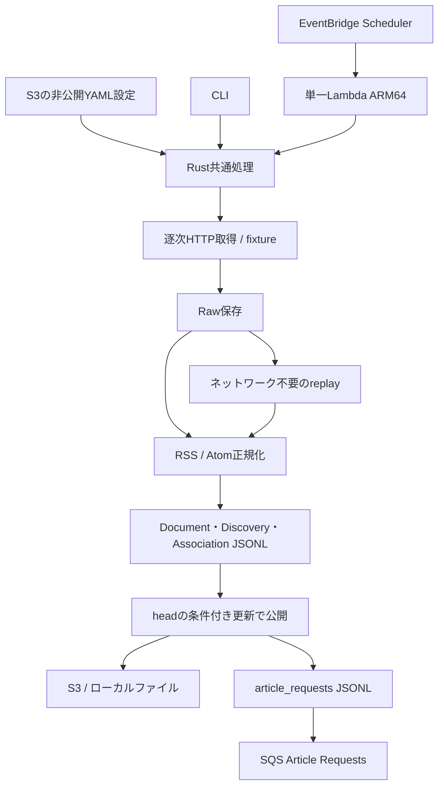

# アーキテクチャ

## 構成


```mermaid
flowchart TD
    Config[S3の非公開YAML設定] --> Core[Rust共通処理]
    CLI[CLI] --> Core
    Scheduler[EventBridge Scheduler] --> Lambda[単一Lambda ARM64]
    Lambda --> Core
    Core --> Fetch[逐次HTTP取得 / fixture]
    Fetch --> Raw[Raw保存]
    Raw --> Normalize[RSS / Atom正規化]
    Normalize --> Batch[Document・Discovery・Association JSONL]
    Batch --> Commit[headの条件付き更新で公開]
    Commit --> Storage[S3 / ローカルファイル]
    Raw --> Replay[ネットワーク不要のreplay]
    Replay --> Normalize
    Commit --> Requests[article_requests JSONL]
    Requests --> Queue[SQS Article Requests]
```

RSS収集、正規化、保存をモジュールとして分け、CLIとLambdaで同じexecuteを使う。
Web Search、外部API追加、LLM、通知、OpenSearch構築はv1対象外。v2の本文取得要求だけは公開済みbatchからSQSへ送る。
Step Functions、DynamoDB、VPC・NATや常時稼働コンポーネントは使用しない。

## 技術選定

| 対象 | 採用と比較 |
| --- | --- |
| アプリ | Rust 1.99.1。型・Result・決定的なIDとAWS SDKを利用し、CLIとLambdaのドメインロジックを共有する。Pythonよりビルド負荷は高いが、型と単一バイナリを重視した。TypeScriptとの比較ではIaCとの言語統一よりRustの既存方針を優先した |
| IaC | TypeScript strict + CDK v2。手書きCloudFormationより構成・権限の型検査とassertionsが容易。Terraformの別ツール体系は増やさない |
| RSS | feed-rs 3。RSS/Atom・XML宣言の非UTF-8をfixtureで検証。ライブラリのID自動補完を無効化し、同一性をアプリ側で決める |
| 設定 | YAML。説明文と配列をTOMLより簡潔に記述できる。serdeで型・未知フィールドを検証し、ID・参照・URLを追加検証する |
| 保存 | Rawはバイト列、正規化はJSONL。単一headのCASを公開境界とし、別のメタデータDBを避ける |
| Lambda | provided.al2023 / ARM64、1024MiB、15分。アカウントの共有同時実行枠を使い、競合はS3 CASで処理する |

直接依存は14日経過した安定版を選定し、Cargo.lockとpackage-lock.jsonで解決結果を固定する。
Rustの推移依存はロックファイルで固定し、全推移依存の公開年齢を保証する仕組みは含めない。
Node 26は開発・CDK用で、LambdaはNodeランタイムを使用しない。

## ディレクトリ

```text
config/                    YAML設定とエディター用JSON Schema
crates/core/               設定・モデル・正規化・収集・保存ユースケース
crates/cli/                ローカルCLI
crates/collector-lambda/   Lambdaエントリーポイント
infra/                     CDK、型検査、構成テスト
fixtures/                  RSS / Atom / 非UTF-8 / 壊れた入力
.github/                   CIと開発基盤の検証
```

実運用のテーマ・情報源設定は、公開リポジトリの実装と分離して非公開S3オブジェクト
`config/v1/topics.yaml`を正とする。Lambdaは起動時にこのオブジェクトを取得し、収集開始前に
未知フィールド・ID・URL・参照整合性を検証する。設定変更だけなら再ビルド・再デプロイは不要だが、
設定は実行環境の初期化時に読むため、既存環境が再利用される間は旧設定のままとなる。
リポジトリの`config/topics.yaml`は形式確認用の公開例であり、実運用データではない。
SSMは使わず、認証が不要なRSS取得にSecrets Manager権限を追加しない。
情報源URLは設定由来の信頼済み入力だが、認証情報付きURLを拒否し、ログはsource_idを使う。

## データと失敗

[データ契約](data-model.md) にID・レイアウト・公開順序・競合時の再計画を記載する。
Raw取得結果を先に固定し、解析失敗も保存済み入力から追跡できるようにする。
HTTPは10秒まで・最大2試行・逐次取得、サイズと件数も制限する。
フィード失敗は部分成功として記録し、保存失敗は呼び出し全体をエラーにする。
Lambdaは全情報源失敗でエラーを返し、部分成功は結果・構造化ログ・CloudWatchのメトリクスで検知する。
head公開後のSQS送信に失敗した場合は同じScheduler event（同じrun ID）を再実行し、公開済みmanifestのarticle_requestsから再送する。SQS Standard Queueの重複配信を前提とし、Processor側で冪等に処理する。

## AWS構成

S3は非公開・SSE-S3・バージョニング・削除時Retain。Rawの自動削除は設定しない。
Lambdaは専用prefixのGetObject/PutObjectと、存在しないキーを404として識別するため専用バケットのListBucketを持つ。
Schedulerの信頼ポリシーはアカウントとschedule groupに限定する。
配信失敗と関数実行失敗のDLQを分け、ログ保持30日、エラー・部分失敗アラームを定義する。
アラームの外部通知先は未設定。運用開始時に人間が監視先と費用を確認する。

## 制約・将来

headはDocument索引と全run参照を保持し全件読み書きする。16MiBに近づく前に分割・コンパクションを設計する。
CAS失敗で残った非公開バッチ・Rawの自動GCは行わない。取り込み側はバッチprefixを直接listしない。
テーマ関連は発見履歴として蓄積し、設定から消したテーマの過去関連も保持する。
自宅OpenSearch同期workerはS3をPullし、RSSと本文のheadで公開されたgenerationを別checkpointで追跡してDocumentをupsertする。再構築は別indexへgeneration 0から投入し、成功後にaliasを切り替える。
GitHub OIDC・専用bootstrapとruntime permissions boundaryを準備し、GitHub Actions経由でAWSアプリを実環境へデプロイした。自宅KubernetesのCronJobによるS3からOpenSearchへの差分同期と、Cloudflare Tunnel / Access配下のUI/APIからの検索を実環境で確認済みである。
詳細は [bootstrap手順](aws-bootstrap.md) を参照する。
