# Architecture

## Overview
This system ingests multiple RSS/Atom feeds on a schedule, normalizes entries into a stable JSON schema, stores both the raw and normalized artifacts in S3, then posts a digest to a private GitHub Discussion with @mention notification.

Primary design goals:
- **Low cost**: avoid high fixed-cost or analysis/LLM services.
- **Reproducibility**: keep raw inputs and normalized outputs.
- **Operability**: failures are localized; reruns are possible.
- **Extensibility**: later add evaluation/learning loop using the archived data.
- **User feedback**: collect like/unlike choices via web form, store in S3 for future training.

---

## Pipeline Concept Diagram

```mermaid
flowchart LR
    RSS["RSS/Atom Feeds<br/>(情報源)"]
    
    subgraph PrePipeline["Pre-Pipeline"]
        direction TB
        Fetch["fetch-sources Lambda<br/>(Rust)<br/>━━━━━━━━<br/>HTTP fetch + retry"]
        Parse["parse-normalize Lambda<br/>(Rust)<br/>━━━━━━━━<br/>Parse RSS/Atom<br/>Normalize to schema"]
    end
    
    subgraph Storage["S3 Storage Layer"]
        direction TB
        RawRSS["📄 raw RSS<br/>raw/v1/date=.../"]
        Items["📋 normalized items<br/>items/v1/date=.../"]
        Digest["� digest outputs<br/>digest/v1/date=.../"]
        Feedback["📊 feedback data<br/>feedback/v1/digest_id=.../"]
    end
    
    subgraph MainPipeline["Main-Pipeline"]
        Build["build-digest Lambda<br/>(Rust)<br/>━━━━━━━━<br/>Filter by rules<br/>Aggregate items<br/>Render Markdown"]
    end
    
    subgraph PostPipeline["Post-Pipeline"]
        Post["post-discussion Lambda<br/>(Rust)<br/>━━━━━━━━<br/>Create Discussion<br/>Post with @mention<br/>Include form link"]
    end
    
    subgraph FormHandler["Form Handler (Lambda Function URL)"]
        Form["form-handler Lambda<br/>(Rust)<br/>━━━━━━━━<br/>GET: render HTML form<br/>POST: save feedback to S3"]
    end
    
    Output["🗨️ GitHub Discussion<br/>(with @mention)"]
    User["👤 User"]
    
    RSS --> Fetch
    Fetch --> RawRSS
    Fetch --> Parse
    Parse --> Items
    Items --> Build
    Build --> Digest
    Digest --> Post
    Post --> Output
    Output --> User
    User -->|フォームリンククリック| Form
    Form -->|like/unlike| Feedback
    
    style PrePipeline fill:#e1f5ff,stroke:#0288d1,stroke-width:2px
    style MainPipeline fill:#fff4e1,stroke:#f57c00,stroke-width:2px
    style PostPipeline fill:#f0e1ff,stroke:#7b1fa2,stroke-width:2px
    style FormHandler fill:#ffe1f5,stroke:#c2185b,stroke-width:2px
    style Storage fill:#e8f5e9,stroke:#388e3c,stroke-width:2px
    style RSS fill:#ffebee
    style Output fill:#e8f5e9
    style User fill:#fff9c4
```



**Pipeline Stages:**

1. **Pre-Pipeline**: Fetches sources (RSS/Atom feeds, etc.) and transforms them into normalized JSON
   - `fetch-sources`: HTTP GET with retry logic, saves raw content to S3
   - `parse-normalize`: Parses RSS/Atom, normalizes to standard schema, saves JSON to S3

2. **Main-Pipeline**: Aggregates and filters normalized items
   - `build-digest`: Applies filtering rules, aggregates recent items, renders Markdown for Discussion

3. **Post-Pipeline**: Posts digest to GitHub Discussion
   - `post-discussion`: Creates Discussion via GitHub GraphQL API with @mention and form link

4. **Form Handler**: Separate Lambda serving dynamic HTML forms
   - GET: Reads digest from S3, renders HTML form with article list
   - POST: Validates and saves user feedback (like/unlike/non-selected) to S3

5. **Storage Layer**: S3 holds all artifacts for replay and auditing
   - Raw RSS for debugging and reprocessing
   - Normalized items for future evaluation/learning
   - Digest outputs for audit trail
   - Feedback data for training datasets

---

## Components

### 1) EventBridge Scheduler
- Triggers the pipeline on a fixed schedule (e.g., daily 07:00 JST).
- Starts the Step Functions state machine execution.

### 2) Step Functions
Orchestrates the entire pipeline with clear separation of concerns:
- **FetchSourcesState**: parallel invocation of fetch-sources Lambda for each source
- **ParseNormalizeState**: parse and normalize fetched sources
- **BuildDigestState**: filter/aggregate items into digest
- **PostDiscussionState**: post digest to GitHub Discussion

Benefits:
- Built-in retry logic per step
- Visual monitoring and debugging
- State passing between Lambdas
- Partial failure handling (continue if some feeds fail)

### 3) AWS Lambda Functions (Rust)
Each Lambda is a separate Rust binary:
- **fetch-sources**: HTTP GET with retry/backoff, save raw content to S3
- **parse-normalize**: parse RSS/Atom/etc., normalize to schema, save to S3
- **build-digest**: filter/aggregate items, render Markdown
- **post-discussion**: call GitHub GraphQL API to create Discussion
- **form-handler**: (Lambda Function URL) serve HTML form, process feedback

Why Rust:
- Fast cold start and execution (low cost)
- Strong type safety
- Excellent AWS SDK support

### 4) Amazon S3
S3 is the system of record for:
- raw RSS (debug/replay)
- normalized items (future evaluation/training data)
- produced digests (audit trail: "what was posted?")
- feedback data (like/unlike choices for future learning)

### 5) GitHub API (GraphQL)
- Creates Discussions in private repository
- Requires authentication via GitHub App or Personal Access Token
- Permissions needed: Discussions (write), Contents (read)

### 6) Lambda Function URL or API Gateway HTTP API
- Provides public endpoint for form-handler Lambda
- Low-cost option for serving dynamic HTML forms
- No VPC or complex routing required

### 7) SSM Parameter Store / Secrets Manager
Stores operational configuration:
- feed URLs (JSON array) - SSM Parameter Store
- GitHub repository info (owner, name, category_id) - SSM Parameter Store
- mention user (GitHub username) - SSM Parameter Store
- S3 bucket name - SSM Parameter Store
- time window for "what counts as new" (e.g., 24h) - SSM Parameter Store
- GitHub token - Secrets Manager
- form URL signing secret (HMAC key) - Secrets Manager

### 8) CDK (TypeScript)
All infrastructure is defined as code:
- **PipelineStack**: Step Functions state machine definition
- **LambdaStack**: Rust Lambda functions (built via cargo-lambda)
- **StorageStack**: S3 buckets and SSM parameters
- **FormStack**: Lambda Function URL and IAM permissions
- **Permissions**: IAM roles with least privilege

Deployment: `cdk deploy --all`

---

## Data Flow (Step Functions)

### Execution Start
EventBridge Scheduler invokes Step Functions state machine with:
- `execution_date`: current date
- `run_id`: unique ID for this run

### State 1: LoadConfig
- Read SSM parameters (feeds, recipients, etc.)
- Pass config to next states

### State 2: FetchSources (Map state, parallel)
For each source URL:
1) **fetch-sources Lambda**: Fetch HTTP response
2) Save raw body to S3 (`raw/v1/date=.../source=.../ts=....xml`)
3) Return S3 path and feed metadata

Failure handling:
- Individual feed failures are caught and logged
- Successful feeds continue to next state
- Step Functions retry on transient errors

### State 3: ParseNormalize (Map state)
For each fetched RSS:
1) **parse-normalize Lambda**: Parse RSS/Atom from S3
2) Normalize each entry to `NormalizedItem(v1)`
3) For each item:
   - Compute deterministic `item_id`
   - Check existence in S3 (`HeadObject`)
   - If not exists: write item JSON to S3
4) Return list of new item IDs

### State 4: BuildDigest
**build-digest Lambda**:
- Inputs: all new item IDs from previous state
- Fetch items from S3
- Apply filters (keyword/domain rules)
- Order by published_at desc
- Render Markdown for Discussion post
- Generate signed form URL with token (digest_id + expiration)
- Save digest artifacts to S3 (`digest/v1/...`)
- Return digest metadata and rendered content

### State 5: PostDiscussion
**post-discussion Lambda**:
- Read digest content from previous state
- Call GitHub GraphQL API to create Discussion
- Include @mention in post body
- Include form link with signed token
- Record success/failure (Discussion URL)

### Failure Recovery
- Step Functions provides automatic retry with exponential backoff
- Each state can be re-executed independently
- State machine execution history enables debugging

---

## Storage Layout (S3)

Recommended prefixes (v1):

### Raw RSS
- `raw/v1/date=YYYY-MM-DD/feed=<url-escaped>/ts=<iso>.xml`

### Normalized items
- `items/v1/date=YYYY-MM-DD/<item_id>.json`

### Digest artifacts
- `digest/v1/date=YYYY-MM-DD/run=<iso>/digest.json`
- `digest/v1/date=YYYY-MM-DD/run=<iso>/discussion.md`

### Feedback data
- `feedback/v1/digest_id=<digest_id>/submitted_at=<iso>-<rand>.json`

Rationale:
- Partitioning by date improves manual navigation and later tooling.
- Keeping digest artifacts enables auditing and troubleshooting.

---

## Normalized Item Schema (v1)

Required fields:
- `schema_version`: "v1"
- `source_feed_url`
- `item_id` (deterministic hash)
- `canonical_url` (or best-effort link)
- `title`
- `published_at` (ISO8601; if missing, infer or omit with flag)
- `fetched_at` (ISO8601)

Optional:
- `authors[]`
- `tags[]` (from RSS categories if present)
- `summary` / `content_snippet`

### Item ID
Deterministic:
- `sha256(canonical_url_or_link + title + published_at_iso)`
- Store as `sha256:<hex>`

This enables idempotent storage and avoids duplicate notifications.

---

## Feedback Data Schema (v1)

User feedback collected via form-handler Lambda:

```json
{
  "digest_id": "2026-02-09T07:00:00+09:00",
  "submitted_at": "2026-02-09T07:10:03+09:00",
  "items": [
    {"item_id": "sha256:...", "choice": "like"},
    {"item_id": "sha256:...", "choice": "unlike"},
    {"item_id": "sha256:...", "choice": "non-selected"}
  ]
}
```

Stored at: `feedback/v1/digest_id=<digest_id>/submitted_at=<iso>-<rand>.json`

---

## Idempotency & Dedupe Strategy (No DynamoDB)
To minimize cost and dependencies:
- Use S3 object keys as the canonical "already seen" registry.
- Dedup check:
  - `HeadObject(items/.../<item_id>.json)` → exists => skip
- Caveat:
  - Rare race conditions are acceptable for a digest system.
  - If strict exactly-once becomes necessary later, add DynamoDB.

---

## Failure Modes & Mitigations

- **Feed fetch timeout / transient 5xx**
  - retry with small backoff (max 2–3 tries)
  - log and continue
- **Malformed XML / encoding issues**
  - store raw anyway
  - parser should be defensive; emit failure per feed
- **GitHub API failure (Discussion creation)**
  - persist digest to S3 first
  - fail the run so it can be retried (digest won't be lost)
  - retry with exponential backoff (Step Functions handles this)
- **Form handler token expiration**
  - set reasonable expiration (e.g., 7 days)
  - show friendly error page if expired
  - user can request new link if needed (future enhancement)

---

## Cost Considerations
Low-cost choices:
- **Step Functions**: Standard workflows are cheap (~$0.025 per 1K state transitions)
- **Lambda (Rust)**: Fast execution = low cost; minimal cold start overhead
- **Lambda Function URL**: Free tier covers typical usage; no API Gateway overhead
- **S3**: Durable storage (cheap)
- **SSM Parameter Store**: Standard parameters are inexpensive
- **GitHub API**: Free for authenticated requests

Why Step Functions is cost-effective here:
- Daily execution = ~30 state transitions/month = negligible cost
- Eliminates custom orchestration code
- Built-in retry and monitoring

Avoided for cost/complexity (for now):
- Bedrock (LLM costs)
- Glue/Athena (analysis overhead)
- OpenSearch (cluster costs)
- DynamoDB (using S3 for state is cheaper for this use case)
- SES (not needed; GitHub notifications are free)

---

## Extensibility (Future: Learning/Evaluation Loop)
Because all artifacts are preserved:
- raw RSS → can be replayed into improved parsers
- normalized items → can be labeled (selected/rejected) via feedback
- digest outputs → can be compared across model/rule versions
- **feedback data** → provides training dataset for learning algorithms

Future additions (not now):
- Use feedback to train ranking/filtering models
- Predict user preferences based on historical like/unlike patterns
- A/B testing different digest formats using feedback metrics
- Lightweight UI or analytics dashboard for feedback analysis

Future additions (not now):
- Feedback links to update item labels
- Separate "selected vs skipped" datasets
- Lightweight UI or GitHub Discussions export
